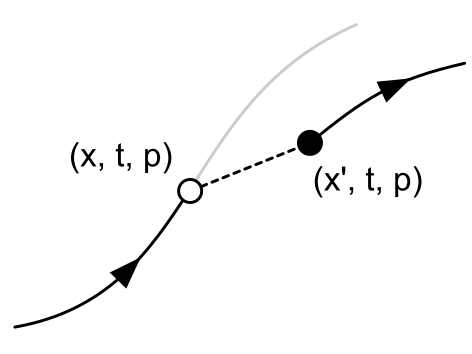
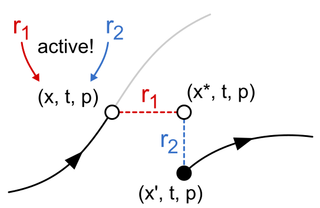
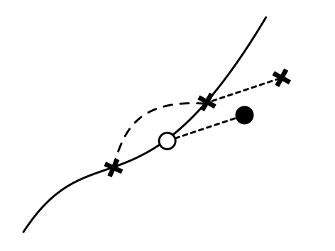
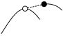

.. _example_reset_interpretation:

Interpretation
--------------

CellML models define two functions:

#. :math:`f(x, t, p) \to fx` calculates the system derivatives :math:`fx` at any point :math:`(x, t, p)`. 
   Note that x contains variables for which an initial value, but no derivative, was defined. 
   For these variables :math:`fx` is zero.

#. :math:`g(x, t, p) \to (x^\prime, t, p)` is a discontinuous mapping from one or more points :math:`(x, t, p)` to points :math:`(x^\prime, t, p)`. 
   Note that :math:`g` can only change the values of :math:`x`. 
   The values of variables in :math:`p` are already fixed by model equations, while we posited above that :math:`t` is not constrained by the model equations or resets.

The first function, :math:`f(x, t, p) \to fx`, is defined by the equations in the model. 
The second function, :math:`g(x, t, p) \to (x^\prime, t, p)`, is defined by the collection of reset rules in the model. 
Note that both parts are optional: a user can supply :math:`f`, :math:`g`, both, or neither.

When started at some initial point :math:`(x_0, t_0, p_0)`, the derivatives in :math:`f` describe the system's trajectory through :math:`(x, t, p)`-space. 
Reset rules add the ability to specify *some* values :math:`(x, t, p)` for which the system should instantaneously jump. 
This is illustrated below, where a trajectory (black line) is interrupted at point :math:`(x, t, p)` by a discontinuous jump (dashed line) to :math:`(x^\prime, t, p)`.

   A discontinuous jump in parameter or variable value is made possible by resets.

Multiple reset rules can act together: :math:`g` is a composite function
~~~~~~~~~~~~~~~~~~~~~~~~~~~~~~~~~~~~~~~~~~~~~~~~~~~~~~~~~~~~~~~~~~~~~~~~

It is important to note that :math:`g` is defined by all reset rules in the model (including those from imported parts).
An individual reset rule is triggered whenever the value of its test variable (some function of :math:`(x, t, p)`) equals its test value (another function of :math:`(x, t, p)`).
At that point, the value of its reset variable (the variable referenced in the :code:`variable` attribute) should be updated to the reset value. 
If multiple reset rules apply to the same reset variable (which must be in either :math:`x` or :math:`p`) at the same point :math:`(x, t, p)`, only the rule with the lowest order attribute will be triggered. The procedure below can be used to determine the jump occurring at a point :math:`(x, t, p)` :

#. For each reset rule, determine whether it is active by checking if its test variable's value matches the test value at :math:`(x, t, p)`.

   a. If more than one reset rule is active for the same reset variable, only the rule with the lowest order is held to be active for that reset variable.
   b. If only one reset rule is active for the same reset variable, select it.
   
#. For each active reset rule, calculate the specified change, using the values :math:`(x, t, p)` to perform any calculation of new values.
#. For each active reset rule, apply the calculated change.
#. Test whether the system is in a new point :math:`(x^\prime, t, p) \neq (x, t, p)`: 

   a. If so, then let :math:`(x, t, p) := (x^\prime, t, p)` and repeat, starting from step 1. 
   #. If not, return the new :math:`(x, t, p)`.

Note that:

- Reset rule evaluation can consist of multiple cycles through steps 1-4.
- For each cycle, all reset rules are tested before any changes are made.
- For each cycle, because only one reset rule can hold per variable, changes to the system state are orthogonal (see :numref:`Figure {number}<reset_rules_2_composite>`); this ensures that the order in which the rules are applied does not matter.
- It is entirely possible for the user to specify infinite loops using reset rules, e.g.: by having the effects of one rule undoing the effects of a previous one.

   Reset rules are applied individually to a variable, ensuring that the order in which they are applied does not affect the final system state; the changes are orthogonal.

Finding the points :math:`(x, t, p)`
~~~~~~~~~~~~~~~~~~~~~~~~~~~~~~~~~~~~

Because it is highly unlikely for a simulated trajectory to include a point :math:`(x, t, p)` exactly, solvers must check if they have passed such a point: for example, by checking if the sign of (test_variable - test_value) has changed. 
If this occurs, it is up to the solver to decide whether to treat the current point as the discontinuity (inexact), or to backtrack and try to find the threshold crossing point exactly.
A graphical example of a "lazy" implementation is given in :numref:`Figure {number}<reset_rules_3_euler>`.

   Resets may be triggered by a change in sign, indicating that the trajectory has been crossed.
   Implementations may use the "lazy" value at the point of detection, or backtracl to determine the point of crossing more exactly.

A particularly difficult case occurs if a reset rule is defined in such a way that (test_variable - test_value) can pass through a root without changing sign (for example, a reset when :math:`sin(t) == 1` as in :numref:`Figure {number}<reset_rules_4_touching>`).

   It's possible for resets to be undetectable when the reset occurs at a root, because the step can pass over the function line without changing sign.

Using this type of reset rule in a simulation may lead to unexpected results, so - like dividing by zero or using reset rules to create infinite loops - is probably best avoided.
