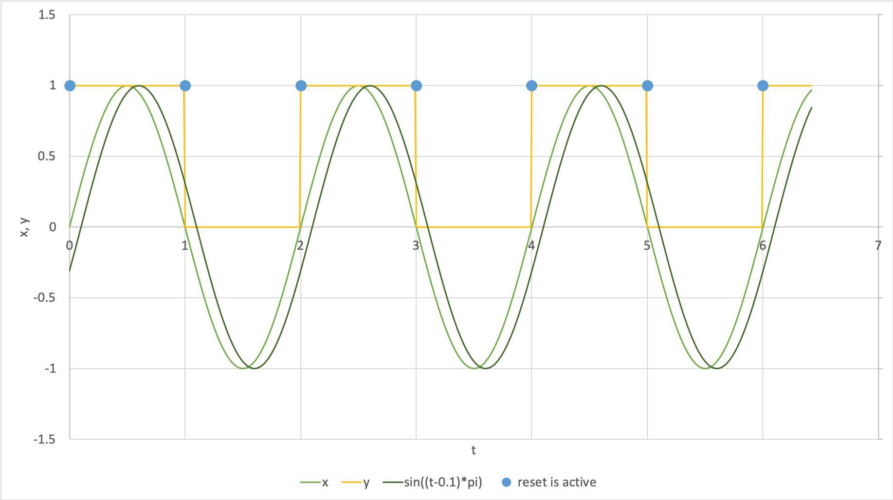

.. _example_reset_misuse_conditionalresetvalue:

Misuse: Conditional reset value
-------------------------------

**Description**: This example shows the valid, but inadvisable, situation of how conditional statements may be given to reset values, and gives an alternative arrangement with the same functionality.
The desired behaviour is shown in :numref:`reset_misuse4_1`.

   Expected behaviour of a reset with a conditional reset value.

.. container:: shortlist

    Note that:

    - all elements are in the same component;
    - the order values of resets are not shown; and
    - all variables have dimensionless units.

.. code-block:: text

    component: ConditionalResetValue
      ├─ math: 
      │   └─ x = sin(t*pi)
      │
      ├─ variable: x
      │
      └─ variable: y initially 0 
          └─ reset: 
              ├─ when x == 0
              └─ then if sin((t-0.1)*pi) < 0 
                          ├─ then y = 1
                          └─ else y = 0

.. container:: toggle

  .. container:: header

      See CellML syntax

  .. code-block:: xml

      <variable name="t" units="dimensionless" />
      <variable name="x" units="dimensionless" />
      <variable name="y" units="dimensionless" initial_value="0" />

      <math>
          <apply><eq/>
              <ci>x</ci>
              <apply><sin/>
                  <apply><times/>
                      <ci>t</ci>
                      <pi/>
                  </apply>
              </apply>
          </apply>
      </math>

      <reset variable="y" test_variable="x">
          <!-- The test value is constant: -->
          <test_value>
              <cn cellml:units="dimensionless">0</cn>
          </test_value>

          <!-- The reset value is decided based on:
                  if sin((t-0.1)*pi) < 0:
                      then reset_value = 1
                      else reset_value = 0 
          -->
          <reset_value>
              <piecewise>
                  <piece>
                      <!-- Conditional statement to decide the reset value. -->
                      <apply><lt/>
                          <apply><sin/>
                              <apply><times/>
                                  <apply><minus/>
                                      <ci>t</ci>
                                      <cn cellml:units="dimensionless">0.1</cn>
                                  </apply>
                                  <pi/>
                              </apply>
                          </apply>
                          <cn cellml:units="dimensionless">0</cn>
                      </apply>
                      <!-- If the condition is met, the reset value is 1. -->
                      <cn cellml:units="dimensionless">1</cn>
                  </piece>
                  <otherwise>
                      <!-- If the condition above is not met, the reset value is 0. -->
                      <cn cellml:units="dimensionless">0</cn>
                  </otherwise>
              </piecewise>
          </reset_value>
      </reset>

It is valid, though probably not advisable, to use conditional statements (the MathML :code:`piecewise`, :code:`piece` and :code:`otherwise` items) when specifying a reset value.
Two alternative arranements which give the same behaviour are shown below.

Suggestions
~~~~~~~~~~~
In the first, we create a dummy variable *r* and apply the conditional statement to its value external to the reset.  
When the reset is active, the value of *r* is retrieved and used as normal.

.. code-block:: text

    component: AvoidingConditionalResetValue1
      ├─ math: 
      │   ├─ x = sin(t*pi)
      │   └─ r = if sin((t-0.1)*pi) < 0 then 1 else 0
      │
      ├─ variable: x
      ├─ variable: r
      └─ variable: y initially 0 
          └─ reset: 
              ├─ when x == 0
              └─ then y = r

.. container:: toggle

  .. container:: header

    Show CellML syntax

  .. code-block:: xml

    <variable name="t" units="dimensionless" />
    <variable name="x" units="dimensionless" />
    <variable name="y" units="dimensionless" initial_value="0" />
    <!-- Include an additional variable and use its value to pass to the reset.-->
    <variable name="r" units="dimensionless" />

    <math>
      <apply>
        <eq/>
        <ci>x</ci>
        <apply>
          <sin/>
          <apply>
            <times/>
            <ci>t</ci>
            <pi/>
          </apply>
        </apply>
      </apply>

      <!-- Include the evaluation of the additional variable in the MathML block.
            The value of r will change each iteration, but will only be passed on to
            the y variable when the reset conditions are met. -->
      <apply>
        <eq/>
        <ci>r</ci>
        <piecewise>
          <piece>
            <!-- Conditional statement to decide the potential reset value. -->
            <apply>
              <lt/>
              <apply>
                <sin/>
                <apply>
                  <times/>
                  <apply>
                    <minus/>
                    <ci>t</ci>
                    <cn cellml:units="dimensionless">0.1</cn>
                  </apply>
                  <pi/>
                </apply>
              </apply>
              <cn cellml:units="dimensionless">0</cn>
            </apply>
            <!-- If the condition is met, then r is 1. -->
            <cn cellml:units="dimensionless">1</cn>
          </piece>
          <otherwise>
            <!-- If the condition above is not met, then r is 0. -->
            <cn cellml:units="dimensionless">0</cn>
          </otherwise>
        </piecewise>
      </apply>
    </math>

    <reset variable="y" test_variable="x">
      <!-- The test value is constant: -->
      <test_value>
        <cn cellml:units="dimensionless">0</cn>
      </test_value>
      <!-- The reset value now uses a pre-computed variable, r: -->
      <reset_value>
        <ci>r</ci>
      </reset_value>
    </reset>

The second method also uses additional resets instead of conditional statements to decide the reset value.

.. code-block:: text

    component: AvoidingConditionalResetValue2
      ├─ math: 
      │   ├─ x = sin(t*pi)
      │   └─ r_test = (sin((t-0.1)*pi))/abs(sin((t-0.1)*pi)
      │
      ├─ variable: x
      ├─ variable: r_test
      ├─ variable: r 
      │   ├─ reset: 
      │   │   ├─ when r_test == -1
      │   │   └─ then r = 1
      │   └─ reset: 
      │       ├─ when r_test == 1
      │       └─ then r = 0
      │
      └─ variable: y initially 0 
          └─ reset: 
              ├─ when x == 0
              └─ then y = r

.. container:: toggle

  .. container:: header

    Show CellML syntax
  
  .. code-block:: xml

    <variable name="t" units="dimensionless" />
    <variable name="x" units="dimensionless" />
    <variable name="y" units="dimensionless" initial_value="0" />
    <variable name="r" units="dimensionless" />
    <!-- Include a sign variable to reset the value of r to pass to the reset for y.-->
    <variable name="r_sign" units="dimensionless" />

    <math>
      <apply>
        <eq/>
        <ci>x</ci>
        <apply>
          <sin/>
          <apply>
            <times/>
            <ci>t</ci>
            <pi/>
          </apply>
        </apply>
      </apply>

      <!-- Include the evaluation of the additional variable in the MathML block.
            The value of r will change each iteration, but will only be passed on to
            the y variable when the reset conditions are met. -->
      <apply>
        <eq/>
        <ci>r_sign</ci>
        <apply>
          <divide/>
          <!-- Potential for divide by zero! Danger! -->
          <apply>
            <abs/>
            <apply>
              <sin/>
              <apply>
                <times/>
                <apply>
                  <minus/>
                  <ci>t</ci>
                  <cn cellml:units="dimensionless">0.1</cn>
                </apply>
                <pi/>
              </apply>
            </apply>
          </apply>
          <apply>
            <sin/>
            <apply>
              <times/>
              <apply>
                <minus/>
                <ci>t</ci>
                <cn cellml:units="dimensionless">0.1</cn>
              </apply>
              <pi/>
            </apply>
          </apply>
        </apply>
      </apply>
    </math>

    <!-- Two new resets which determine the value of r to be passed (when applicable) to the y variable: -->
    <reset variable="r" test_variable="r_sign" order="2">
      <test_value>
        <cn cellml:units="dimensionless">1</cn>
      </test_value>
      <reset_value>
        <cn cellml:units="dimensionless">0</cn>
      </reset_value>
    </reset>
    <reset variable="r" test_variable="r_sign" order="1">
      <test_value>
        <cn cellml:units="dimensionless">-1</cn>
      </test_value>
      <reset_value>
        <cn cellml:units="dimensionless">1</cn>
      </reset_value>
    </reset>

    <reset variable="y" test_variable="x">
      <test_value>
        <cn cellml:units="dimensionless">0</cn>
      </test_value>
      <!-- The reset value now uses the pre-computed variable, r. -->
      <reset_value>
        <ci>r</ci>
      </reset_value>
    </reset>